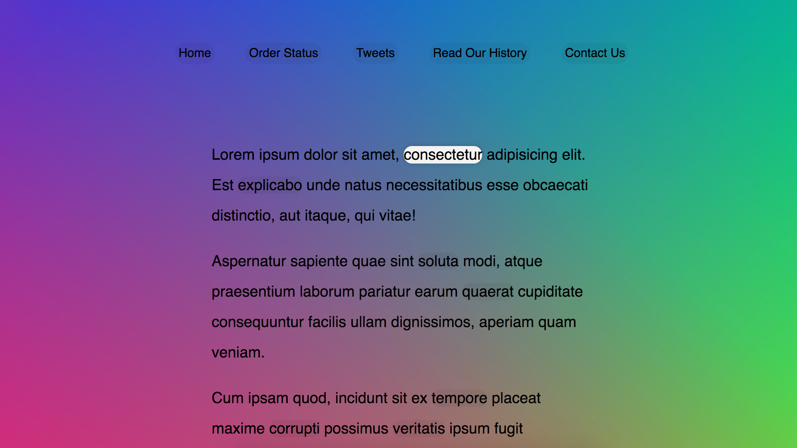
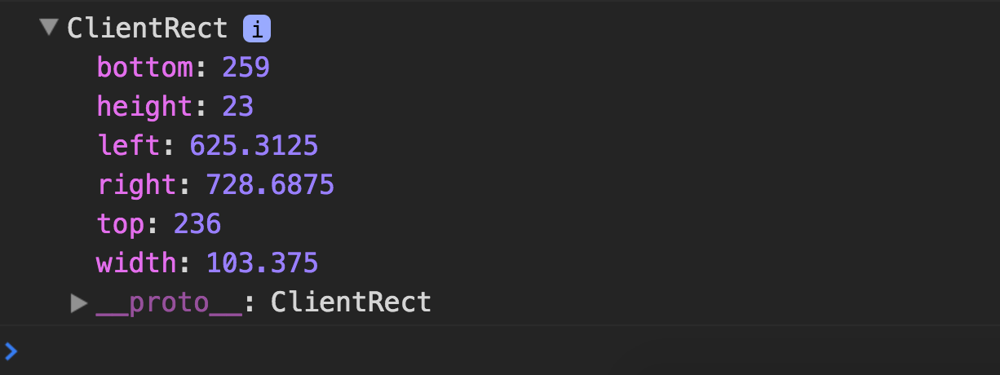

> This is a JavaScript practice with [JavaScript30](https://javascript30.com/) by [Wes Bos](https://github.com/wesbos) without any frameworks, no compilers, no boilerplate, and no libraries.

# 22 - Follow Along Links



view demo [here](https://varmakollu.github.io/JavaScript30/2220-%20Follow%20Along%20Link%20Highlighter/index.html)

### To `createElement()` and `append()` it on to the DOM

```
const triggers = document.querySelectorAll('a');
const highlight = document.createElement('span');

highlight.classList.add('highlight');
document.body.append(highlight);
```

### The `highlightLink()` function

```
function highlightLink() {
  const linkCoords = this.getBoundingClientRect();
  // console.log(this);  // <a> itself
  console.log(linkCoords);

  const coords = {
    width: linkCoords.width,
    height: linkCoords.height,
    top: linkCoords.top + window.scrollY,
    left: linkCoords.left + window.scrollX
  };

  highlight.style.width =`${coords.width}px`;
  highlight.style.height =`${coords.height}px`;
  highlight.style.transform = `translate(${coords.left}px, ${coords.top}px)`;
}

triggers.forEach(a => a.addEventListener('mouseenter', highlightLink));
```

**[NOTE]** need to add `window.scrollX` and `window.scrollX` to prevent wrong position while scroll occured

```
top: linkCoords.top + window.scrollY,
left: linkCoords.left + window.scrollX
```

- `this`: every single `<a>` element itself
- to `console.log(linkCoords);` will get


we can see what we have here



### Set a initial start corrdinates

because we don't want it "slide" in from the `(X,Y) = (0,0)` of window's coordinates, so let's set it start from the first `<li>` element of `<nav>`

```
const initStart = {
  left: initCoord.left + window.scrollX,
  top: initCoord.top + window.scrollY
};

highlight.style.transform = `translate(${initStart.left}px, ${initStart.top}px)`;
```
