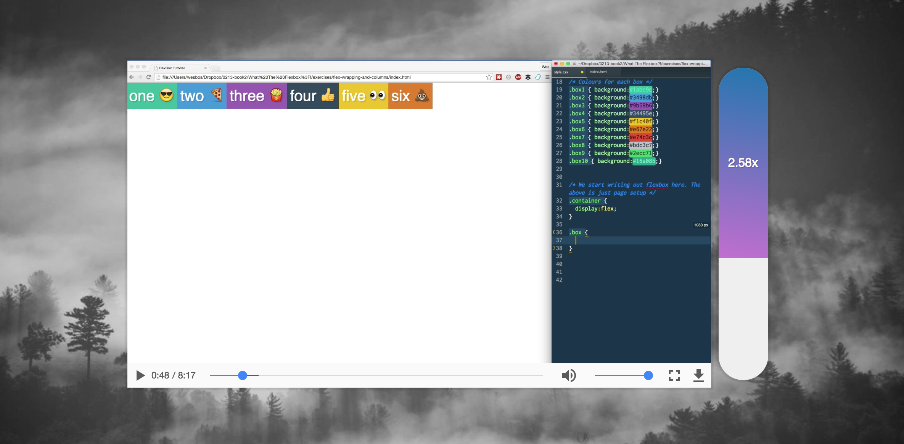

> This is a JavaScript practice with [JavaScript30](https://javascript30.com/) by [Wes Bos](https://github.com/wesbos) without any frameworks, no compilers, no boilerplate, and no libraries.

# 28 - Video Speed Controller



view demo [here](https://varmakollu.github.io/JavaScript30/28%20-%20Video%20Speed%20Controller/index.html)

### Handle Speed function

```
function handleSpeed(e) {
  const y = e.pageY - this.offsetTop;
  const percent = y / this.offsetHeight;
  const min = 0.4;
  const max = 4;
  const height = Math.round(percent * 100) + '%';
  const playbackRate = percent * (max - min) + min;
  bar.style.height = height;
  bar.textContent = playbackRate.toFixed(2) + 'x';
  video.playbackRate = playbackRate;
}
```

- `y = e.pageY - this.offsetTop;`: take the offset at which the top of the parent is, and subtract the offset from the y coordinate, which gives us just how much of the bar is to be filled
- `percent = y / this.offsetHeight;`: calculate the height(%), divide Y by the total height of the parent, `y/offsetHeight` will give us the decimal %

```
const min = 0.4;
const max = 4;
const height = Math.round(percent * 100) + '%';
```

- define the boundaries of `min` and `max` our own, and multiply by 100 and get how much % of space is to be filled by `speed-bar`.

```
const playbackRate = percent * (max - min) + min;
```

- find the number associated with that much height and use it as playback rate. at 0 height should be 0.4, and at 100 height it should be 2.5, so we do `percent * (max - min) + min` to match it, and assig it to `video.playbackRate`

- `toFixed(2);` displays the number with 2 decimal places
